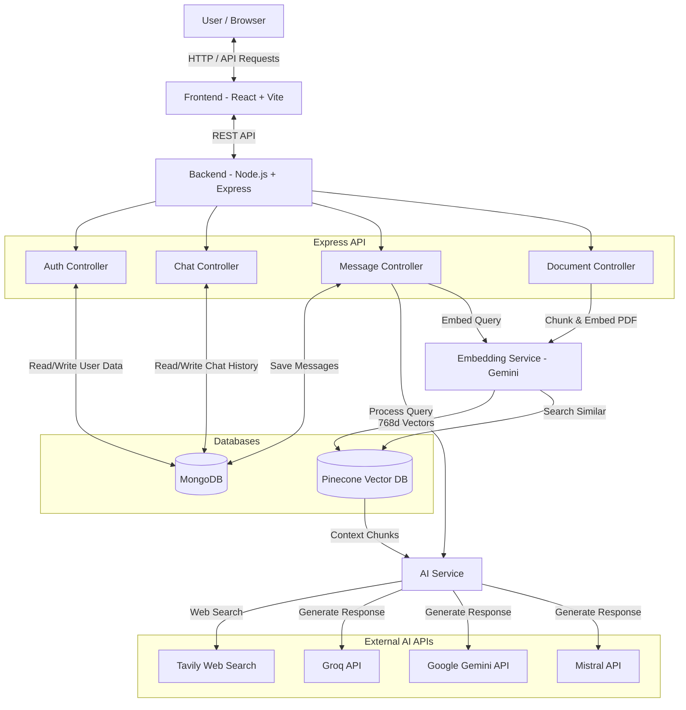

# Perplexity Clone Architecture

This document provides a high-level overview of the complete full-stack architecture for the Perplexity Clone project.

## High-Level System Architecture

## 1. Frontend (React + Vite)
- **Framework:** React.js bootstrapped with Vite for high performance.
- **State Management:** Redux Toolkit (`chatSlice.js`, `authSlice.js`).
- **Styling:** TailwindCSS for rapid UI development and modern aesthetic.
- **Routing:** React Router DOM (Login, Register, Home).
- **Core Components:**
  - `Sidebar.jsx`: Manages chat history and UI navigation.
  - `ChatArea.jsx` & `MessageBubble.jsx`: Handles displaying AI messages, citations, and markdown rendering.
  - `InputBar.jsx`: The command center for sending messages, toggling web search, choosing AI models, and uploading PDFs.

## 2. Backend (Node.js + Express)
- **Framework:** Express.js running in a monorepo structure (serves both API and static frontend files).
- **Database:** MongoDB via Mongoose for structured data (Users, Chats, Messages).
- **Authentication:** JSON Web Tokens (JWT) for stateless session management.
- **File Uploads:** Multer for handling incoming PDF documents.

## 3. Retrieval-Augmented Generation (RAG) Layer
- **Vector Database:** Pinecone (`@pinecone-database/pinecone`).
- **Embeddings:** Google's `gemini-embedding-2` model via Langchain (`@langchain/google-genai`).
- **Processing:** `PDFLoader` and `RecursiveCharacterTextSplitter` chunk documents into small semantic pieces.
- **Flow:** When a user uploads a PDF, it is chunked and stored in Pinecone. When they ask a question, the backend searches Pinecone for relevant context and silently injects it into the LLM's system prompt.

## 4. AI Generation & Web Search
- **AI Models:** Supports interchangeable usage of `gemini-1.5-flash`, `llama-3.1-8b-instant` (Groq), and `mistral-large-latest` (MistralAI).
- **Web Search:** Integrated with the `Tavily` API for real-time web scraping and search citations.

## 5. Deployment
- **Platform:** Render.com (or Railway).
- **Structure:** Monorepo deployment. The Node.js server builds the Vite frontend during deployment and statically serves the `frontend/dist` folder via Express (`express.static`), resulting in a single web service rather than separated front/back services.
